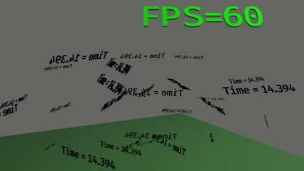

# bevy_text_mesh &emsp; [![Build Status]][actions] [![Latest Version]][crates.io] [![Docs Version]][docs]

[Build Status]: https://img.shields.io/github/workflow/status/blaind/bevy_text_mesh/test
[actions]: https://github.com/blaind/bevy_text_mesh/actions?query=branch%3Amain
[Latest Version]: https://img.shields.io/crates/v/bevy_text_mesh.svg
[crates.io]: https://crates.io/crates/bevy_text_mesh

[Docs Version]: https://docs.rs/bevy_text_mesh/badge.svg
[docs]: https://docs.rs/bevy_text_mesh

A bevy 3D text mesh generator plugin for displaying text in 3D scenes



The text mesh is generated at runtime from runtime-tessellated (and cached) TrueType font glyphs. Tessellation of glyphs is done with C-based [github.com/fetisov/ttf2mesh](https://github.com/fetisov/ttf2mesh/) library that is being interfaced through Rust-based FFI API (see [ttf2glyph-rs](https://crates.io/crates/ttf2mesh)).

## Known limitations

Consider this as a preview of the plugin for gathering feedback about the API:

* **The API will change in future - still iterating**
* Currently supporting bevy github main head (e.g. no support for bevy 0.5)
* Multiple `TextMesh` configuration fields are not implemented yet, see example below
* Text color update is not implemented yet
* Spacing of characters are incorrect
* Mesh cache purging is not implemented - this implementation will  leak memory
* Crate exposes an asset loader for `.ttf` files, and replaces any other loaders (e.g. `bevy_text`)
* **Currently, do not expose for untrusted font input**

## Usage

For full examples, see the [examples](/examples) -folder.

Prequisites (for compiling [ttf2mesh-rs](https://crates.io/crates/ttf2mesh)):

    apt-get install build-essential patch

Add to Cargo.toml:

```
[dependencies]
bevy_text_mesh = { git = "https://github.com/blaind/bevy_text_mesh" }
```

Include the library:

```rust
use bevy_text_mesh::prelude::*;
```

Second, add a `TextMeshPlugin` to your app:

```rust
App::build()
    ...
    .add_plugin(TextMeshPlugin)
    ...;
```

Then, add the desired TrueType-fonts (with suffix `.ttf`) into your assets folder, a good convention is to store them to `assets/fonts` folder.

For example, see Fira fonts. Please read also their [LICENSE](https://github.com/mozilla/Fira/blob/master/LICENSE).

    mkdir -p assets/fonts
    wget https://github.com/mozilla/Fira/raw/master/ttf/FiraSans-Medium.ttf -O assets/fonts/FiraSans-Medium.ttf

Next, you are ready to spawn a text in your scene at a system:

First, load a font asset:

```rust
let font: Handle<TextMeshFont> = asset_server.load("fonts/FiraSans-Medium.ttf");
```

Then, spawn a textmesh bundle:
```rust
commands.spawn_bundle(TextMeshBundle {
    text_mesh: TextMesh::new_with_color("Hello Bevy", Color::rgb(1., 1., 0.)),
    transform: Transform::from_xyz(-1., 1.75, 0.),
    ..Default::default()
});
```

Or with expanded syntax:

```rust
commands.spawn_bundle(TextMeshBundle {
    text_mesh: TextMesh {
        text: String::from("Hello Bevy!"),
        style: TextMeshStyle {
            font,
            font_size: SizeUnit::NonStandard(36.),
            color: Color::rgb(1.0, 1.0, 0.0),
            font_style: FontStyle::UPPERCASE, // only UPPERCASE & LOWERCASE implemented currently
            mesh_quality: Quality::Low,
            ..Default::default()
        },
        alignment: TextMeshAlignment {
            vertical: VerticalAlign::Top, // FUNCTIONALITY NOT IMPLEMENTED YET - NO EFFECT
            horizontal: HorizontalAlign::Left, // FUNCTIONALITY NOT IMPLEMENTED YET - NO EFFECT
            ..Default::default()
        },
        size: TextMeshSize {
            width: SizeUnit::NonStandard(135.),       // partially implemented
            height: SizeUnit::NonStandard(50.),       // partially implemented
            depth: Some(SizeUnit::NonStandard(50.0)), // must be > 0 currently, 2d mesh not supported yet
            wrapping: true,                           // partially implemented
            overflow: false,                          // NOT IMPLEMENTED YET
            ..Default::default()
        },
        ..Default::default()
    },
    transform: Transform {
        translation: Vec3::new(-1., 1.75, 0.),
        ..Default::default()
    },
    ..Default::default()
});
```

## License

Licensed under <a href="LICENSE">MIT license</a>

### Contribution

Unless you explicitly state otherwise, any contribution intentionally submitted
for inclusion in the software by you,  shall be licensed as above, without any additional terms or conditions.

